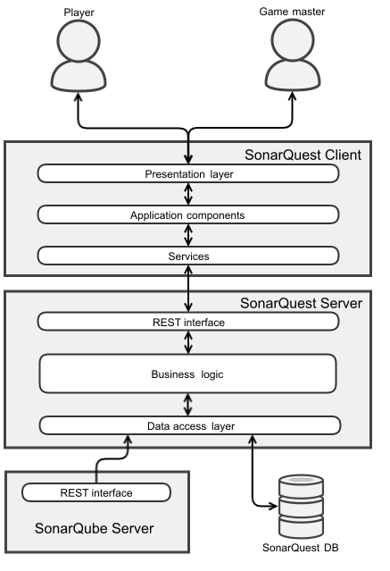
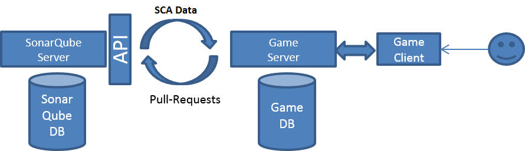

# Technical documentation of SonarQuest
Following, the components of SonarQuest are described.
Firstly, the general architecture is explained, followed by the installation guide.

## Architecture
General overview:

### SonarQuest server

The SonarQuest server is the central component of SonarQuest. It extracts the issues and projects from SonarQube and makes all game resources and processes available via a REST-API.

The SonarQuest server is a single web application which ensures the independency from SonarQube and CI-Updates. Moreover it supports the basic idea that users should participate voluntarily in SonarQuest.
The server performs cyclic pull requests to the SonarQube API to load the issues. Afterwards the issues are processed and saved in the database. This mechanism should be easy to configure. Additionally, it should be possible to manually activate it.

#### Used technologies and projects
The SonarQuest server is a *Spring Boot* application on the basis of *Java*. A Tomcat webserver and a H2 database that includes the SonarQuest schema are embedded.

Links:
* [Spring Boot](https://projects.spring.io/spring-boot/)

### SonarQuest client

The SonarQuest client provides the user interface of SonarQuest as web application.
It uses the resources of the REST interface of the SonarQuest server.
The user can control the game via the web application.

#### Used technologies and projects
The SonarQuest client is a *Angular* application on the basis of *TypeScript*. *Angular Material*, *Teradata Covalent* and *RPG-Awesome* (Icons) are used for the UI. You need *Node.js* for your development environment.

Links:
* [Angular](https://angular.io)
* [Angular Material](https://material.angular.io)
* [Teradata Covalent](https://teradata.github.io/covalent/#/)
* [RPG-Awesome](https://nagoshiashumari.github.io/Rpg-Awesome/)
* [Node.js](https://nodejs.org/en/)

## Installation guide
Please install the components in the following order because they are dependent on each other.

### SonarQuest server

The SonarQuest server is a maven project and can be installed and started with Maven.

#### Usage

SonarQuest can either connect to a real SonarQube server, or simulate one. To use the simulated one start SonarQuest with `--simulateSonarServer=true`, e.g. write `mvn spring-boot:run -DsimulateSonarServer=true` (when you're in the backend directory).

The SonarQuest server then initializes the world and quests.

The SonarQuest database is initialised with the scheme `schema.sql` and is filled with the data from `data.sql`.
Those files can be found in `src/main/resources/`.
The SonarQuest server is started from the `main` method of the class `SonarQuestApplication` in the folder `src/main/com/viadee/sonarQuest`.
Afterwards you can access the server at:

`http://localhost:8080`

#### Test
Momentarily, only one test case exists that tests the most important functions of the server by simulating a game process.
To execute the test you have to comment the lines in the method `run` of the class `SonarQuestApplication`.
This prevents the initialisation of the data from the (simulated) sonar server and allows the execution with mock data.
Finally, you can run the test by executing the class `SonarQuestApplicationTests` in the folder `src/test/java/com/viadee/sonarQuest`.

### SonarQuest client

Firstly, you have to install *Node.js*. Please follow the instructions on the *Node.js* website.
*Angular-Cli* is required for starting a development environment and building the application.
Install *Angular-Cli* globally with

`npm install -g @angular/cli`

After that you can start the SonarQuest client:
1. switch to the directorty: `cd sonarQuest-frontend`
2. install the node modules: `npm install`
3. start the test server with the SonarQuest client: `ng server`

You can access the SonarQuest client in a browser at `http://localhost:4200`

Use `ng build` to create a build of the SonarQuest client. This is integrated into the directory `src/main/resources/static` and can be accessed in a browser at `http://localhost:8080` if the SonarQuest server is running.
